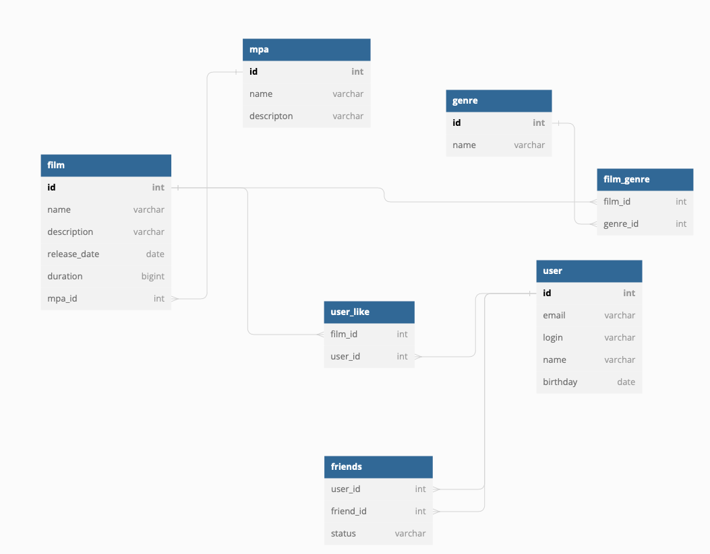

# java-filmorate

### ER диаграмма создана при помощи [dbdiagram.io](https://dbdiagram.io/) ###




### Код ###
```
Table film {
 id int [pk]
 name varchar
 description varchar
 releaseDate date
 duration bigint
 ageLimit int
}

Ref: film.id < user_like.filmid
Ref: film.ageLimit > age_limit.id

Table age_limit {
 id int [pk]
 name varchar
 descripton varchar
}

Table genre {
 id int [pk]
 name varchar
}
Ref: genre.id < film_genre.genreId

Table film_genre {
 filmId int 
 genreId int
}
Ref: film_genre.filmId > film.id

Table user {
 id int [pk]
 email varchar
 login varchar
 name varchar
 birthday date
}
Ref: user.id < user_like.userid

Table friends {
 userId int 
 friendId int 
 status varchar
}
Ref: friends.userId > user.id
Ref: friends.friendId > user.id

Table user_like {
 filmid int 
 userid int 
}


```